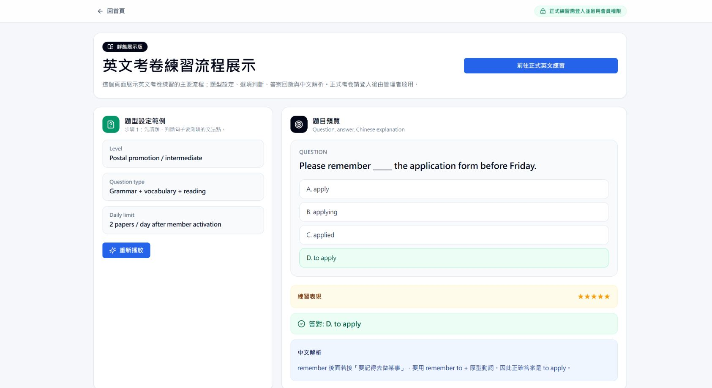
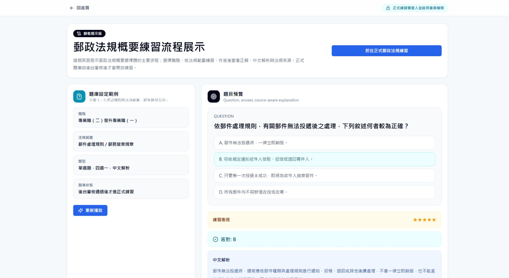

# AI Exam Coach

AI Exam Coach is a deployable exam-practice MVP for postal promotion exam preparation. It combines civil law essay grading, English full-exam practice, postal regulations practice, member access control, usage limits, learning records, and an admin dashboard.

The project is designed as a portfolio-ready AI product prototype: it demonstrates how LLM workflows, structured scoring, database-backed access control, and cost protection can be integrated into a real learning scenario.

- GitHub: [kebilly/ai-exam-coach](https://github.com/kebilly/ai-exam-coach)
- Live Demo: [ai-exam-coach-beta.vercel.app](https://ai-exam-coach-beta.vercel.app/)
- Status: deployable MVP / production prototype for controlled small-group testing

## Screenshots

### Platform Overview


### Civil Law Essay Grading Demo


### English Exam Practice Demo



### Postal Regulations Practice Demo



### Member Login And Access Control


## Project Motivation

The initial problem was not simply "generate questions with AI." The goal was to build a small but realistic learning product that can:

- help examinees practice repeatedly under limited time
- identify weak points in civil law essay answers
- provide English and postal regulations practice aligned with promotion exams
- prevent uncontrolled API usage before members are approved
- preserve learning records for later review
- demonstrate AI strategy, product planning, system architecture, and implementation ability

## Core Features

### Civil Law Essay Grading

- Accepts civil law essay questions and student answers.
- Supports random verified civil-law essay prompts with longer fact patterns.
- Provides scores, issue analysis, legal authority feedback, reasoning feedback, conclusion feedback, strengths, weaknesses, and next-practice suggestions.
- Supports OCR upload for handwritten answer recognition.
- Uses structured grading JSON and a legacy adapter to keep frontend cards stable.
- Includes anchor answers, diagnostics, score caps, and regression tests for grading stability.

### English Full-Exam Practice

- Builds complete English practice papers instead of one-off short questions.
- Includes vocabulary, grammar, cloze, reading, and translation-oriented practice depending on exam level.
- Uses Chinese explanations so learners can review mistakes quickly.
- For higher-level translation practice, uses paragraph-level prompts closer to historical exam difficulty while avoiding direct reuse of exam text.

### Postal Regulations Practice

- Covers postal law, postal savings and remittances law, simple life insurance law, mail handling rules, and postal business regulations.
- Supports different question modes by career level:
  - Professional II to Professional I: mainly single-choice questions.
  - Professional I to Operations: fill-in and short-answer style practice.
- Uses source-aware seed questions and review statuses.
- Records attempts and supports daily limits.

### Member Access Control

- Users register and log in through Supabase Auth.
- Formal practice APIs require member or admin access.
- Admins can activate/deactivate users.
- Invite codes are hashed before storage.
- Demo pages are designed to illustrate the workflow without exposing formal API usage.

### Admin Dashboard

- View users, roles, plans, and usage state.
- Activate or deactivate formal member access.
- Promote or demote admin role.
- Generate and disable invite codes.
- Review civil law, English, postal regulations, and usage records by user.
- Delete individual practice or usage records when needed.

## System Architecture

```text
Next.js App Router
  |
  |-- Public Demo Pages
  |     |-- Civil Law Demo
  |     |-- English Demo
  |     |-- Postal Regulations Demo
  |
  |-- Member Pages
  |     |-- Dashboard
  |     |-- Civil Law Practice
  |     |-- English Exam Practice
  |     |-- Postal Regulations Practice
  |     |-- History
  |
  |-- Admin Pages
  |     |-- User Management
  |     |-- Invite Codes
  |     |-- Practice Records
  |
  |-- API Routes
        |-- /api/law/grade
        |-- /api/law/ocr
        |-- /api/english/generate
        |-- /api/english/submit
        |-- /api/postal-rules/start
        |-- /api/postal-rules/submit
        |-- /api/profile/unlock
        |-- /api/admin/*

Supabase
  |-- Auth
  |-- PostgreSQL
  |-- Row Level Security

OpenAI API
  |-- Civil law grading
  |-- OCR support
```

## Civil Law Grading Design

The civil law grading module is located in:

```text
src/lib/civil-law-grading/
```

Key files:

```text
config.ts          grading dimensions, weights, score caps, and version settings
schema.ts          structured JSON grading output schema
service.ts         grading workflow, rubric selection, element evaluation, and scoring
prompts.ts         prompt layers for civil-law grading
anchors.ts         high/mid/low anchor answers
legacy-adapter.ts  maps structured grading JSON to frontend score cards
```

The grading design emphasizes:

- verified rubric selection before formal grading
- element-level subsumption analysis
- importance-weighted element scoring
- programmatic score aggregation
- score caps for major defects
- deduction tracking with evidence
- regression diagnostics for calibration

This prevents the model from freely inventing final scores and makes grading behavior easier to test, explain, and maintain.

## Tech Stack

- Framework: Next.js App Router
- Language: TypeScript
- UI: React, Tailwind CSS, lucide-react
- Backend: Next.js API Routes
- Auth / Database: Supabase Auth and PostgreSQL
- AI: OpenAI API
- Validation: Zod
- Deployment: Vercel
- Testing / Diagnostics: custom TypeScript regression and diagnostic scripts

## Security And API Key Management

The project separates browser-safe configuration from server-only secrets.

Browser-safe variables:

```text
NEXT_PUBLIC_SUPABASE_URL
NEXT_PUBLIC_SUPABASE_ANON_KEY
NEXT_PUBLIC_SITE_URL
```

Server-only variables:

```text
SUPABASE_SERVICE_ROLE_KEY
OPENAI_API_KEY
OPENAI_MODEL
```

Formal APIs enforce:

- valid Supabase session
- member/admin access
- daily usage limits
- server-side OpenAI calls only
- no client-side OpenAI key exposure
- admin-only user management routes

Sensitive local files are ignored by Git:

```text
.env
.env.local
.next
node_modules
backups
output
tmp
.vercel
```

Additional GitHub safety notes are documented in:

```text
docs/github-security-check-notes.md
```

## Database

Database schema and security hardening SQL are in:

```text
supabase/schema.sql
supabase/security-hardening.sql
```

Main tables include:

```text
user_profiles
law_submissions
english_exercises
postal_rule_attempts
postal_rule_questions
usage_logs
member_invite_codes
```

The database supports:

- user profile and role/plan control
- practice history
- usage tracking
- hashed invite codes
- RLS-based user isolation
- admin-only server-side management

## Environment Variables

Create `.env.local` from `.env.example`.

Required local variables:

```text
NEXT_PUBLIC_SUPABASE_URL=
NEXT_PUBLIC_SUPABASE_ANON_KEY=
SUPABASE_SERVICE_ROLE_KEY=
OPENAI_API_KEY=
NEXT_PUBLIC_SITE_URL=http://localhost:4000
DAILY_USAGE_LIMIT=10
LAW_DAILY_LIMIT=2
LAW_OCR_DAILY_LIMIT=3
ENGLISH_DAILY_LIMIT=2
POSTAL_RULES_DAILY_LIMIT=2
UNLOCK_ATTEMPT_DAILY_LIMIT=10
DEMO_API_ENABLED=false
```

For Vercel, set the same variables in Project Settings > Environment Variables. Do not commit `.env.local`.

## Local Development

Install dependencies:

```cmd
npm install
```

Run locally on port 4000:

```cmd
cd /d C:\Projects\LAW_KK
npm run dev -- -p 4000
```

Local URL:

```text
http://localhost:4000
```

Useful pages:

```text
http://localhost:4000/
http://localhost:4000/demo/law
http://localhost:4000/demo/english
http://localhost:4000/demo/postal-rules
http://localhost:4000/dashboard
http://localhost:4000/admin
```

## Verification

Run TypeScript check:

```cmd
npx tsc --noEmit --incremental false
```

Run civil law regression tests:

```cmd
npm run test:civil-law
```

Run civil law diagnostic report:

```cmd
npm run diagnose:civil-law
```

Run production build:

```cmd
npm run build
```

Avoid running `npm run build` while `npm run dev` is active, because both may write to `.next`.

## Deployment

Current deployment target:

```text
Vercel
```

Typical deployment flow:

```cmd
git status
git add .
git commit -m "Update feature"
git push
```

Vercel redeploys automatically when the connected GitHub `main` branch receives a new commit. If only environment variables are changed in Vercel, manually trigger Redeploy.

## Resume Screenshot Candidates

Recommended screenshots for resume or portfolio use:

1. `docs/images/overview.png` - Best for showing the complete product positioning: three practice modules, member access control, and daily usage limits.

2. `docs/images/civil-law-grading-demo.png` - Best for showing the AI grading value: score cards, issue/legal/reasoning feedback, strengths, and improvement suggestions.

3. `docs/images/postal-rules-demo.png` - Best for showing exam-specific expansion beyond LLM chat: source-aware postal regulations practice with answer/explanation flow.

## Portfolio Highlights

This project demonstrates:

- AI product planning for a real learning workflow
- LLM workflow design beyond a generic chatbot
- legal-domain rubric design and grading calibration
- prompt/schema/scoring separation
- member access control and API cost protection
- Supabase Auth and PostgreSQL integration
- admin operations and usage visibility
- regression testing for grading stability
- deployable Next.js/Vercel architecture

## Limitations And Disclaimer

- Civil law grading is for exam practice and learning feedback only.
- The system does not provide legal advice.
- Postal regulations questions should be reviewed against the latest official rules before high-stakes use.
- The MVP is optimized for controlled small-group testing, not unlimited public traffic.
- Current civil law grading quality depends on verified rubric coverage; unsupported question types may be rejected or require new rubric calibration.
